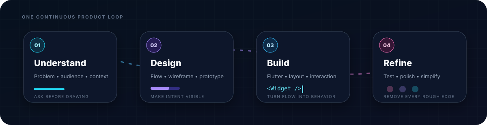
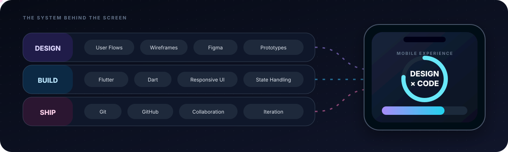

<!--
  IQRA WAHEED · GITHUB PROFILE README
  Theme: Design-to-Code / Aurora Interface Lab
  Keep all SVG files in the repository root beside this README.
-->

<p align="center">
  
</p>

<p align="center">
  <a href="#process"><b>PROCESS</b></a>&nbsp;&nbsp;·&nbsp;&nbsp;
  <a href="#craft"><b>CRAFT</b></a>&nbsp;&nbsp;·&nbsp;&nbsp;
  <a href="#work"><b>WORK</b></a>&nbsp;&nbsp;·&nbsp;&nbsp;
  <a href="#journey"><b>JOURNEY</b></a>&nbsp;&nbsp;·&nbsp;&nbsp;
  <a href="#contact"><b>CONTACT</b></a>
</p>

<br/>

<div align="center">

### I do not treat design and development as separate worlds.

From the first user flow to the final Flutter widget, I build mobile experiences as one connected system — **clear in purpose, thoughtful in interaction and polished in execution.**

</div>

<br/>

<a id="process"></a>

## `01 / PROCESS`

<p align="center">
  
</p>

<br/>

<a id="craft"></a>

## `02 / THE CRAFT`

<p align="center">
  
</p>

<table>
<tr>
<td width="33%" valign="top">

### ✦ Product Thinking

I begin with the user, the context and the problem—not with decoration.

`User Flows` `Information Architecture` `Usability`

</td>
<td width="33%" valign="top">

### ✦ Interface Design

I turn ideas into clear mobile flows, wireframes and high-fidelity Figma prototypes.

`Figma` `Wireframes` `Prototypes` `Visual Hierarchy`

</td>
<td width="33%" valign="top">

### ✦ Flutter Engineering

I translate designs into responsive Flutter layouts, reusable components and intuitive interactions.

`Flutter` `Dart` `Navigation` `State Handling`

</td>
</tr>
</table>

<br/>

<a id="work"></a>

## `03 / SELECTED WORK`

<table>
<tr>
<td width="50%" valign="top">



### Health & Wellness Ecosystem

A high-stakes health experience designed to make real-time metrics feel understandable rather than overwhelming.

**My role**

* Architected the mobile side in Flutter
* Built responsive, performance-conscious interfaces
* Worked with custom health-data visualizations
* Focused on smooth interaction and visual clarity

`Flutter` `Dart` `Responsive UI` `Data Visualization`

<!-- Replace # with the repository or case-study link when ready. -->

<a href="#"><b>CASE STUDY COMING SOON ↗</b></a>

</td>
<td width="50%" valign="top">



### Focus & Productivity App

A distraction-free student experience for protecting attention during deep-work sessions.

**My role**

* Designed calm, student-focused UI flows
* Planned the initial product and app structure
* Implemented core screens and navigation in Flutter
* Kept the experience purposeful and visually quiet

`Flutter` `Dart` `Figma` `Student UX`

<!-- Replace # with the repository or case-study link when ready. -->

<a href="#"><b>IN DEVELOPMENT · FOLLOW THE BUILD ↗</b></a>

</td>
</tr>
</table>

<br/>

<a id="journey"></a>

## `04 / JOURNEY`

<details open>
<summary><b>Product Designer & Flutter Developer · cnoFuzion Technologies</b> &nbsp; <code>Jun 2025 — Present</code></summary>
<br/>

I work across both sides of the mobile-product process:

* Design mobile interfaces, user flows, wireframes and high-fidelity prototypes in Figma
* Make usability and clean layout decisions before implementation
* Convert selected designs into responsive Flutter screens
* Work with UI components, navigation and layout optimization
* Collaborate with developers on accurate design implementation
* Contribute within real production-code and team workflows

</details>

<details>
<summary><b>Bachelor's in Computer Science · University of Management & Technology</b> &nbsp; <code>Oct 2023 — Present</code></summary>
<br/>

Building a computer-science foundation alongside practical work in Flutter development, interface design and real product implementation.

</details>

<details>
<summary><b>Community · AWS Cloud Club Core Team</b></summary>
<br/>

Managed graphics and media content, supported event communication and helped organize workshops for club members—strengthening my visual communication, teamwork and community-building skills.

</details>

<br/>

## `05 / CREDENTIALS`

<table>
<tr>
<td width="50%" align="center" valign="top">

### Google UX Design

**Professional Certificate · Coursera · 2025**

User-centered design · Wireframing · Prototyping · UX process · Usability

<!-- Add your certificate URL below when available. -->


</td>
<td width="50%" align="center" valign="top">

### Flutter & Dart

**The Complete Guide · Udemy · 2024**

Flutter development · Dart fundamentals · Mobile interfaces · App structure

<!-- Add your certificate URL below when available. -->


</td>
</tr>
</table>

<br/>

## `06 / CURRENT SIGNAL`

```dart
const currentFocus = {
  'craft': 'responsive Flutter interfaces',
  'thinking': 'clearer user journeys',
  'practice': 'Figma → Flutter systems',
  'goal': 'mobile products people enjoy using',
};
```

> **The goal is not to make every screen louder. The goal is to make every interaction clearer.**

<br/>

<a id="contact"></a>

## `07 / LET'S CREATE SOMETHING USEFUL`

<div align="center">

I am open to **Flutter development, mobile UI/UX, product-design collaborations, internships and entry-level opportunities.**

<br/>

<a href="https://www.linkedin.com/in/iqra-waheed2002/">
  
</a>
&nbsp;
<a href="https://github.com/Iqra-stack-tech?tab=repositories">
  
</a>

</div>

<br/>

<p align="center">
  
</p>
